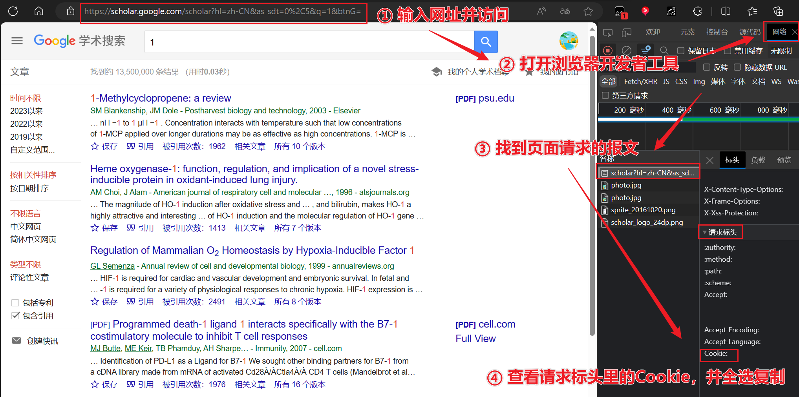

# Get Bibtex from Google Scholar

本仓库分成两种不同的使用方式，一种是使用python中谷歌学术中批量获取Bibtex，另一种是使用浏览器插件直接在dblp中获取Bibtex。

## 1. Python 批量获取 Bibtex

根据关键词列表谷歌学术搜索，批量获取对应的第一个Bibtex。

注：谷歌学术搜索支持模糊搜索，所以**可以直接把pdf或word的文献引用一整条复制直接作为关键词**，这样搜索已经足够精确了，完全没必要开高级搜索。

### 使用方式

1. 在`words.txt`中添加关键词，以换行分隔。
2. 根据下图，访问[https://scholar.google.com/scholar?hl=zh-CN&as_sdt=0%2C5&q=1&btnG=](https://scholar.google.com/scholar?hl=zh-CN&as_sdt=0%2C5&q=1&btnG=)获取Cookie，将Cookie填入`words_to_bibtex.py`的`headers['Cookie']=""`中。

3. 运行`words_to_bibtex.py`。
4. 查看`result_bibtex.txt`和`result_cite.txt`中的结果。
5. 如果你是使用代理的，可以在`words_to_bibtex.py`中启用set_proxy函数。

谷歌学术搜索有人机验证，如果跑着跑着突然报错了，只需要在浏览器再次访问[https://scholar.google.com/scholar?hl=zh-CN&as_sdt=0%2C5&q=1&btnG=](https://scholar.google.com/scholar?hl=zh-CN&as_sdt=0%2C5&q=1&btnG=)，手动过掉这个页面上的人机验证、复制一个新Cookie就OK。

### 示例

输入（查找关键词前会去掉`words.txt`中所有已经在`done.txt`中的关键词）：
```python
# done.txt
空
# words.txt:
[6]	Cheng Kai, Li Qiang, Wang Lei, et al. DTaint: Detecting the Taint-Style Vulnerability in Embedded Device Firmware[C] //Proc of the 48th Annual IEEE/IFIP Int Conf on Dependable Systems and Networks (DSN). 2018: 430-441
```

输出（查找到结果后`done.txt`会新增一行，不过`words.txt`中的内容不会立即被删除）：
```python
# done.txt
[6]	Cheng Kai, Li Qiang, Wang Lei, et al. DTaint: Detecting the Taint-Style Vulnerability in Embedded Device Firmware[C] //Proc of the 48th Annual IEEE/IFIP Int Conf on Dependable Systems and Networks (DSN). 2018: 430-441
# result_bibtex.txt:
@inproceedings{cheng2018dtaint,
  title={DTaint: detecting the taint-style vulnerability in embedded device firmware},
  author={Cheng, Kai and Li, Qiang and Wang, Lei and Chen, Qian and Zheng, Yaowen and Sun, Limin and Liang, Zhenkai},
  booktitle={2018 48th Annual IEEE/IFIP International Conference on Dependable Systems and Networks (DSN)},
  pages={430--441},
  year={2018},
  organization={IEEE}
}
# result_cite.txt:
[6]	\cite{cheng2018dtaint}
```

## 2. 浏览器插件直接获取 Bibtex

这个脚本安装之后页面左下角会出现一个按钮，可以通过选项去配置按钮是否出现。

用处：当选中文本之后，会自动在dblp中搜索并返回第一个搜索结果对应的Bibtex到剪切板上。

### 使用方式

1. 首先，你需要安装油猴插件，如果不知道怎么装请看我的视频：[【浏览器脚本入门】①下载油猴_哔哩哔哩_bilibili](https://www.bilibili.com/video/BV1AN4y1Y7mo)
2. 其次，你可以通过 Greasy Fork 安装我的脚本：[选择文本并自动获取BibTex到剪切板](https://greasyfork.org/zh-CN/scripts/522825-%E9%80%89%E6%8B%A9%E6%96%87%E6%9C%AC%E5%B9%B6%E8%87%AA%E5%8A%A8%E8%8E%B7%E5%8F%96bibtex%E5%88%B0%E5%89%AA%E5%88%87%E6%9D%BF)

## 可加功能

- [x] 改写成浏览器插件，支持选中关键词直接右键获取Bibtex；
- [ ] words_from_pdf: 从文献pdf中提取参考文献列表，将其直接作为关键词；
- [ ] words_from_doc: 从文献doc中提取参考文献列表，将其直接作为关键词；
- [ ] cite_to_bibtex: 将文本中的索引号直接变成bibtex的latex引用，比如`[6]`变成`\cite{cheng2018dtaint}`。